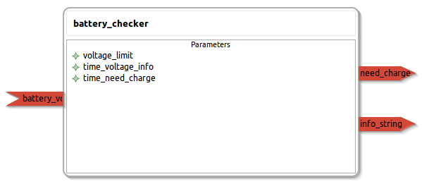

battery_checker
====================

General description
---------------------
The battery_checker package

Node: battery_checker
---------------------
#### Parameters
**voltage_limit** *(double, default: 4.0)*
<!--- protected region voltage_limit on begin -->
<!--- protected region voltage_limit end -->

**time_voltage_info** *(double, default: 600.0)*
<!--- protected region time_voltage_info on begin -->
<!--- protected region time_voltage_info end -->

**time_need_charge** *(double, default: 300)*
<!--- protected region time_need_charge on begin -->
<!--- protected region time_need_charge end -->

#### Published Topics
**info_string** *(std_msgs::String)*   
<!--- protected region info_string on begin -->
<!--- protected region info_string end -->

**need_charge** *(std_msgs::Empty)*   
<!--- protected region need_charge on begin -->
<!--- protected region need_charge end -->

#### Subscribed Topics
**battery_voltage** *(std_msgs::Float32)*   
<!--- protected region battery_voltage on begin -->
<!--- protected region battery_voltage end -->

