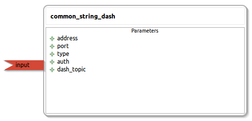

common_string_dash
====================

General description
---------------------
The common_string_dash package

Node: common_string_dash
---------------------
#### Parameters
**address** *(string, default: 192.168.0.1)*
<!--- protected region address on begin -->
<!--- protected region address end -->

**port** *(string, default: 3030)*
<!--- protected region port on begin -->
<!--- protected region port end -->

**type** *(string, default: text)*
<!--- protected region type on begin -->
<!--- protected region type end -->

**auth** *(string, default: YOUR_AUTH_TOKEN)*
<!--- protected region auth on begin -->
<!--- protected region auth end -->

**dash_topic** *(string, default: welcome)*
<!--- protected region dash_topic on begin -->
<!--- protected region dash_topic end -->

#### Published Topics

#### Subscribed Topics
**input** *(std_msgs::String)*   
<!--- protected region input on begin -->
<!--- protected region input end -->

