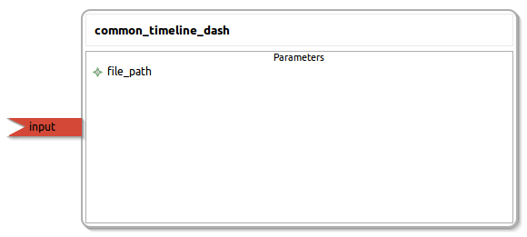

common_timeline_dash
====================

General description
---------------------
The common_timeline_dash package. Send the string : "Month Day Year Color Message" and it will be added to the timeline at the correct date. Example : "Dec 25 2015 white Christmas Day Holiday"

Node: common_timeline_dash
---------------------
#### Parameters
**file_path** *(string, default: /home/jbot/home_dashboard_project/timeline_data.yml)*
<!--- protected region file_path on begin -->
<!--- protected region file_path end -->

#### Published Topics

#### Subscribed Topics
**input** *(std_msgs::String)*   
<!--- protected region input on begin -->
<!--- protected region input end -->

