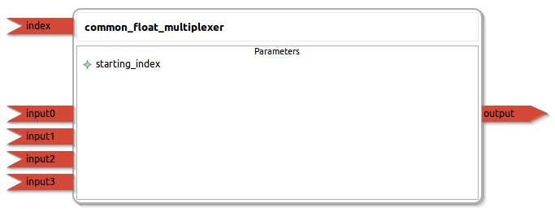

common_float_multiplexer
====================

General description
---------------------
The common_float_multiplexer package

Node: common_float_multiplexer
---------------------
#### Parameters
**starting_index** *(int, default: 0)*
<!--- protected region starting_index on begin -->
<!--- protected region starting_index end -->

#### Published Topics
**output** *(std_msgs::Float32)*   
<!--- protected region output on begin -->
<!--- protected region output end -->

#### Subscribed Topics
**index** *(std_msgs::Int8)*   
<!--- protected region index on begin -->
<!--- protected region index end -->

**input0** *(std_msgs::Float32)*   
<!--- protected region input0 on begin -->
<!--- protected region input0 end -->

**input1** *(std_msgs::Float32)*   
<!--- protected region input1 on begin -->
<!--- protected region input1 end -->

**input2** *(std_msgs::Float32)*   
<!--- protected region input2 on begin -->
<!--- protected region input2 end -->

**input3** *(std_msgs::Float32)*   
<!--- protected region input3 on begin -->
<!--- protected region input3 end -->

