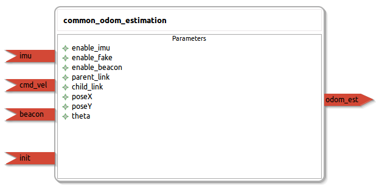

common_odom_estimation
====================

General description
---------------------
The common_odom_estimation package that allows to compute a robot position in the field

Node: common_odom_estimation
---------------------
#### Parameters
**enable_imu** *(int, default: 0)*
<!--- protected region enable_imu on begin -->
<!--- protected region enable_imu end -->

**enable_fake** *(int, default: 1)*
<!--- protected region enable_fake on begin -->
<!--- protected region enable_fake end -->

**enable_beacon** *(int, default: 0)*
<!--- protected region enable_beacon on begin -->
<!--- protected region enable_beacon end -->

**parent_link** *(string, default: map)*
<!--- protected region parent_link on begin -->
<!--- protected region parent_link end -->

**child_link** *(string, default: base_link)*
<!--- protected region child_link on begin -->
<!--- protected region child_link end -->

#### Published Topics

#### Subscribed Topics
**imu** *(sensor_msgs::Imu)*   
<!--- protected region imu on begin -->
<!--- protected region imu end -->

**cmd_vel** *(geometry_msgs::Twist)*   
<!--- protected region cmd_vel on begin -->
<!--- protected region cmd_vel end -->

**beacon** *(geometry_msgs::Pose2D)*   
<!--- protected region beacon on begin -->
<!--- protected region beacon end -->

