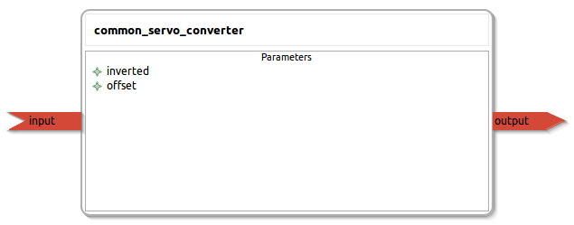

common_servo_converter
====================

General description
---------------------
The common_servo_converter package usefull to drive a servo which can have an offset or be inverted

Node: common_servo_converter
---------------------
#### Parameters
**inverted** *(int, default: 0)*
<!--- protected region inverted on begin -->
<!--- protected region inverted end -->

**offset** *(int, default: 0)*
<!--- protected region offset on begin -->
<!--- protected region offset end -->

#### Published Topics
**output** *(std_msgs::UInt16)*   
<!--- protected region output on begin -->
<!--- protected region output end -->

#### Subscribed Topics
**input** *(std_msgs::UInt16)*   
<!--- protected region input on begin -->
<!--- protected region input end -->

