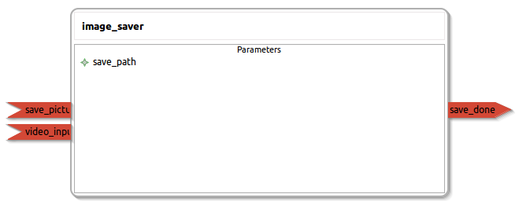

image_saver
====================

General description
---------------------
The image_saver package

Node: image_saver
---------------------
#### Parameters
**save_path** *(string, default: ~/save.jpg)*
<!--- protected region save_path on begin -->
<!--- protected region save_path end -->

#### Published Topics
**save_done** *(std_msgs::String)*   
<!--- protected region save_done on begin -->
<!--- protected region save_done end -->

#### Subscribed Topics
**save_picture** *(std_msgs::Empty)*   
<!--- protected region save_picture on begin -->
<!--- protected region save_picture end -->

**video_input** *(sensor_msgs::Image)*   
<!--- protected region video_input on begin -->
<!--- protected region video_input end -->

