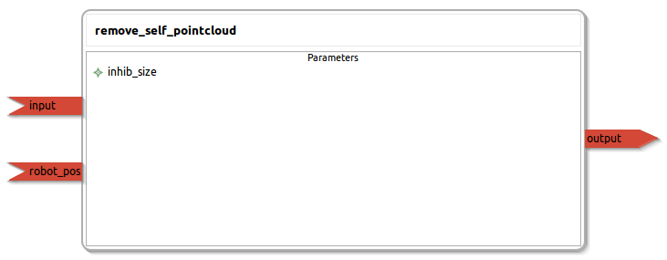

remove_self_pointcloud
====================

General description
---------------------
The remove_self_pointcloud package

Node: remove_self_pointcloud
---------------------
#### Parameters
**inhib_size** *(double, default: 0.05)*
<!--- protected region inhib_size on begin -->
<!--- protected region inhib_size end -->

#### Published Topics
**output** *(sensor_msgs::PointCloud2)*   
<!--- protected region output on begin -->
<!--- protected region output end -->

#### Subscribed Topics
**input** *(sensor_msgs::PointCloud2)*   
<!--- protected region input on begin -->
<!--- protected region input end -->

**robot_position** *(nav_msgs::Odometry)*   
<!--- protected region robot_position on begin -->
<!--- protected region robot_position end -->

