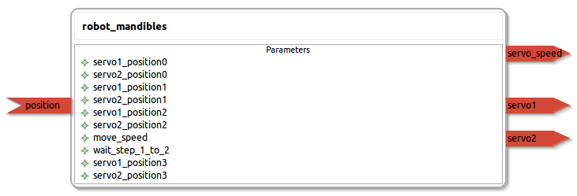

robot_mandibles
====================

General description
---------------------
The robot_mandibles package. servo1 is always the first servo to move when opening.

Node: robot_mandibles
---------------------
#### Parameters
**servo1_position0** *(int, default: 90)*
<!--- protected region servo1_position0 on begin -->
<!--- protected region servo1_position0 end -->

**servo2_position0** *(int, default: 90)*
<!--- protected region servo2_position0 on begin -->
<!--- protected region servo2_position0 end -->

**servo1_position1** *(int, default: 100)*
<!--- protected region servo1_position1 on begin -->
<!--- protected region servo1_position1 end -->

**servo2_position1** *(int, default: 100)*
<!--- protected region servo2_position1 on begin -->
<!--- protected region servo2_position1 end -->

**servo1_position2** *(int, default: 80)*
<!--- protected region servo1_position2 on begin -->
<!--- protected region servo1_position2 end -->

**servo2_position2** *(int, default: 80)*
<!--- protected region servo2_position2 on begin -->
<!--- protected region servo2_position2 end -->

**move_speed** *(int, default: 3)*
<!--- protected region move_speed on begin -->
<!--- protected region move_speed end -->

**wait_step_1_to_2** *(double, default: 1.0)*
<!--- protected region wait_step_1_to_2 on begin -->
<!--- protected region wait_step_1_to_2 end -->

#### Published Topics
**servo_speed** *(std_msgs::UInt16)*   
<!--- protected region servo_speed on begin -->
<!--- protected region servo_speed end -->

**servo1** *(std_msgs::UInt16)*   
<!--- protected region servo1 on begin -->
<!--- protected region servo1 end -->

**servo2** *(std_msgs::UInt16)*   
<!--- protected region servo2 on begin -->
<!--- protected region servo2 end -->

#### Subscribed Topics
**position** *(std_msgs::UInt16)*   
<!--- protected region position on begin -->
<!--- protected region position end -->

